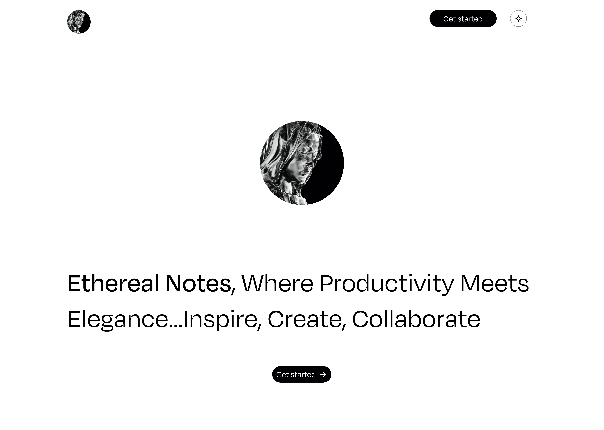

# Ethereal Notes

Ethereal Notes represents the forefront of note-taking and
productivity solutions, integrating cutting-edge technologies like
Next.js 14, Tailwind CSS, and Shadcn UI to create a truly
captivating note-taking experience. Immerse yourself in an elegantly
designed platform that goes beyond the ordinary. With an intuitive
interface and the robust backend powered by Convex, Ethereal Notes
ensures not just a seamless note-taking experience but also
prioritizes data security and efficiency powered by Convex. Step into a realm where
productivity meets innovation. Ethereal Notes redefines how you
capture, organize, and utilize your ideas, promising a
future-forward approach to managing information and enhancing
workflows. Elevate your productivity effortlessly with Ethereal
Notes – the gateway to a new era of streamlined efficiency.

## Demo

https://next-ethereal-notes.vercel.app/

## Technologies Used

- [Next.js 14](https://nextjs.org/)
- [Tailwind CSS](https://tailwindcss.com/) 
- [Convex](https://www.convex.dev/)
- [Shadcn UI](https://ui.shadcn.com/)

## Installation

- npm install
- npm install convex
- npx convex dev
